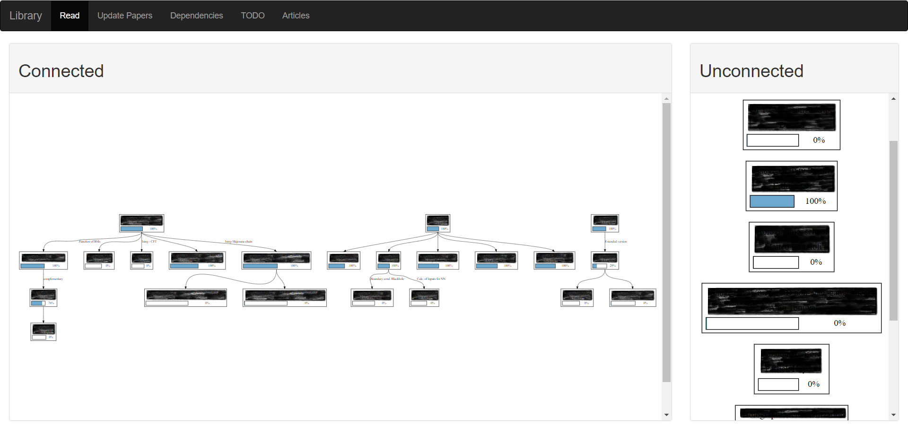

# Library

Library is a simple tool to structure papers and their connections.

It is developed while my master thesis preparing, and was born by the urge to structure the papers I am currently reading.
An example image can be seen below. The titles of the articles were blurred out after taking the image.


## Requirements
Parts of it are based on the gravphiz software. 
It can be found at: https://graphviz.org/

## Notes
I am developing and improving this tool currently.
Furthermore, I am actively working with it and therefore 
I am a little bit pragmatic corresponding to the look of the tool.
Maybe it will be improved in the future.


If you have any ideas how to improve or find bugs please tell me.

## Updates
Added column for unconnected articles.
They are now seperated from the connected ones

Improved performance of loading by home and update... 
The images are now generated before

Refractor administration.py

## Usage
### Setup
Install graphviz and the required packages:
- flask
- gravphiz
- pypdf2

create a "path.py" and insert the following line:
```PATH = "<your path were to add the working data>"```

Start the main.py

Open the website at the link which is presented by python.

### Working 
Place papers in the Articles directory at your path.
The system will check all articles every start or if you press the Library button on the web page

Zoom whit the mouse wheel into the graph.
Move the graph by pressing your left mouse button and move it arround.

To read a paper click at it while the Read section in the navbar is chosen.
Similar for all the other actions (I think I made most relevant things accessible via a click)

Click on a Connection to configre its proberties.


I think the other possibilties explain themselves.
But maybe I will write something to this... some day (sorry :)).

### Tipps:
Place a run_library.py file at your Desktop.
Insert:
```
import os

PATH = "<path to main.py>"

os.startfile(PATH)
os.startfile("<url to the website>")
```

When you double click it, the library is started and your default browser will open the website.


## TODO:
- Improve paper update form
- add non weight dependency
- add summery option to paper
- make paper green with checkbox to indicate it is finished
