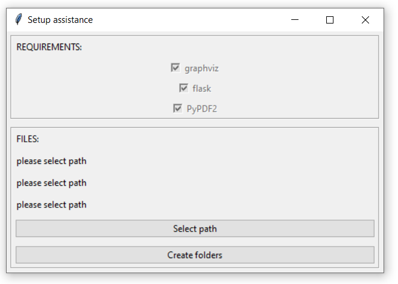

# Library 2.1 (ALPHA RELEASE)

!Attention! The current version is the alpha release of Libary 2.0.
If you encounter any bug please report it!

Library is a simple tool to structure papers and their connections.
It is based on the gravphiz software. Some example images can be seen 
bellow. See images in the gallery.

## Requirements
Parts of it are based on the gravphiz software. 
It can be found at: https://graphviz.org/

## Notes
`os.startfile()` is used within this program (as far as I know Windows only). 
It therefore may not be compatible with operating systems besides windows.
I have added a few lines of code which should make it possible for linux/mac too but have not tested it.

If you have any ideas how to improve or find bugs please tell me via the uploaded reports.

## Update notes
### Update to Version 2.0 (It is not compatible to Version 1.0)
- Added projects to the workflow
- Added summery option for articles

### Update to Version 2.1
- BUGFIX: URL mistake in solograph
- BUGFIX: app.run() missing at end of file
- BUGFIX: changed ','-separator in associate articles to ':' to avoid problems with multi authors

## Usage
### Setup
#### Install requirements
Install graphviz (software) and the required packages:
- flask
- gravphiz (python package)
- PyPDF2

#### Create folders
1. Start 'create_folder.py'
2. Control if all three checkmarks are set in the REQUIREMENTS-frame (cf. Image bellow)
3. Select a path and create the folders



#### Getting to the GUI (graphical user interface)
1. Start the main.py
2. Open the website at the link which is presented by python

#### If automatic setup does not work:
Create a "path.py" and insert the following line:
```PATH = "<your absolute path where to add the working data>"```.

Create an "Article" folder within `PATH`.
Therefore, you should have such a structure (example):
```
...
 |-Library
      |- Article <add papers into this folder>
      <an article.db will be automatically created here>
      <an .config file will be automatically created here>
```
In this example is `PATH = "...\Library"`


### Working 

#### Add articles
To add articles to the program, place them in the directory of the programm.
This directory can be accessed, when the 'Directory' button in the navbar is pressed.
Articles within this directory will automatically added to the article list.

#### Setup a project
The most outer part is a project. A project contains some articles, their connections, and some tasks which should be done.
Articles can be assigned to different projects.
However, the state and summary of the articles is synchronized between different projects.

- A project can be created on the right side of the main page. The project name should not contain
  any spaces. It can be altered or deleted using the other menus on the right side

- To access a project just click on its name on the front page

- To add articles to the project press the 'Associate Articles' button in the navbar.
  On this document you can add articles. The articles on the left side are not yet associated.
  To associate them, click at their names. They should switch to the right list.
  To remove the association of articles on the right list, click on them too. 
  However, if the article is part of a dependency to other articles on the project, it will be grey and non-clickable.
  To remove such an article, delete the dependency first.

- To update articles in the project, choose the 'Update Articles' part in the navbar. All associated articles
  should be shown on this page. On the right side the unconnected articles are shown. On the left, bigger panel,
  the connected articles and their dependencies are shown. Click on an article to open its summary and state panel.
  On the left panel (the big textarea) a summary of the most important aspects of the paper can be written.
  In the right pannel (smaller one) the stats of the papers are written. They can be changed. USE SUBMIT TO SAVE YOUR
  CHANGES.

- To read an article in the project, select the 'Read' part in the navbar. If you click on an article it should be opened
  with the default program of your computer.

- To add dependencies to an article, select the 'Depedencies' part in the navbar. Select the articles in the left panel
  by pressing at their name. Use the 'Create dependency' button to create a dependency. The dependencies are shown
  in a panel to the right. Clicking on them opens a configuration side. You can add a small reason for the connection,
  which will be shown in the connection_graph. Moreover, you can delete the connection on this page.
  However, you can also access this page by pressing at the connection in the read section.

- To escape the project press on the projects name in the navbar. You will be forwarded back to the
  main page with all projects listed.


### Tips:
Place a ```run_library.py``` file at your desktop.
Insert:
```
import os

PATH = "<path to main.py>"

os.startfile(PATH)
os.startfile("<url to the website>")
```

When you double-click it, the library is started, and your default browser will open the website.

### Gallery